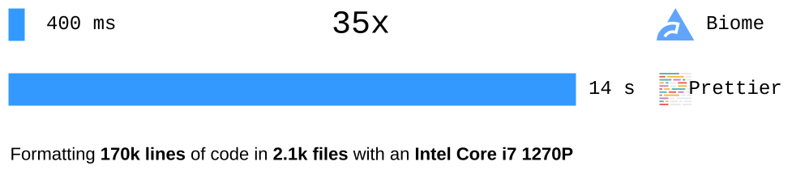

<!--
_class: lead
_paginate: skip
-->

**Victorien Elvinger**
_@Conaclos_
Biome lead maintainer

---
<!--
_class: lead invert
_paginate: hide
-->

# What is **Biome**?

---

## A code **linter**

- JavaScript, **TypeScript, JSX**, TSX
  - no extra dependencies

- **Helpful diagnostics**

- **200 lint rules**
  - some unique to Biome
  - ESLint, ESLint plugins
  - 🚧 Tailwind class sorting

---

## A code **formatter**

- JavaScript, TypeScript, JSX, TSX
- JSON, JSONC
- 🚧 CSS
- **format invalid code**

---

<!--
_class: lead invert
_paginate: hide
-->

---

<!--
_class: lead invert
_paginate: hide
-->

---

<!--
_class: lead invert
_paginate: hide
-->

---
<!--
_class: lead invert
_paginate: hide
-->

# Is Biome **fast**?

---

<!--
_class: lead invert
_paginate: hide
-->

---

## A **community**

- ⬇️ 170k weekly downloads
- ⭐ 8.4k GitHub Stars
- 🐦 4.6k followers
- 💬 1.2k Discord members

---
<!--
_class: lead invert
_paginate: hide
-->

# How Biome works?

---

## Architecture

- **leader-follower**
- the leader thread
  - spawn a thread per file
  - collect results
- a follower thread
  - parse the given file
  - handle (format, lint)

---

## Regular parser

1. parse to an Abstract Syntax Tree
2. handle (format, lint)

---

## Regular parser

- doesn't handle invalid code
  - **emit syntax error**

---

## **Biome** parser

- **accept invalid code**
  - bogus tree nodes
  - holes in the tree

- **lossless** parsing using CST
  - preserve whitespace

---

## **Biome** parser

- **accept invalid code**
  - bogus tree nodes
  - holes in the tree

- **lossless** parsing using CST
  - preserve whitespace

---

## Lint rules

- many rules query the tree
  - noVar
  - noDoubleEquals
  - noAccumulatingSpread

- others need more complex data
  - **noUnusedVariables**
  - noUnusedImports
  - useImportType
  - useExportType

---

## Semantic model

- find references of a declaration
  - write refrences
  - read references

---

## Name resolver v1

- bind declarations to references
  - unique id for each declaration
  - a reference refers to a single declaration
- take scopes into account
  - variable shadowing

---

## TypeScript 🤯

- **type & variable** with **same name**

---

## TypeScript 🤯

- type & variable with same name
- **a reference** can refer to a **type** and a **variable**

---

## TypeScript 🤯🤯

- type & variable with same name
- ~~a reference can refer to a type and a variable~~
- **a reference** can refer to **multiple declarations**

---

## TypeScript 🤯

- type & variable with same name
- ~~a reference can refer to a type and a variable~~
- a reference can refer to multiple declarations
- **partially referenced declarations**
  - type / variable duality

---

## Simplification

- a reference refers to a **single declaration**
  - handle differently edge cases (_export_, _infer_)
- type and value with same names
- type / variable duality

---

## Name resolver v2

- A declaration is either
  - a type
  - a variable
  - both
- A reference refers either
  - a type
  - a varaible

---

## Name resolver v2

- A declaration is either
  - a type
  - a variable
  - both
- A reference refers either
  - a type
  - a varaible
- type/value duality not exposed

---

## Conclusion

- Biome is both a **formatter** and a **linter**
  - and more: JavaScript **import sorting**
- Biome is **fast**
- Biome is **editor-ready**
  - error-resilient parsers
  - Concrete Syntax Tree
- Biome **supports TypeScript**
  - type-aware semantic model

---

## 2024 and beyond

- extend to **more languages**
  - CSS, HTML, Markdown
  - Vue, Angular, Svelte, Astro
- **improve linter capabilities**
  - multi-file analysis
  - simplified type system
- 🧱 **plugins**

---

## Want to help?

- 🚀 try Biome
  - 🐛 report issues
  - 💬 feedbacks
- contribute to Biome
  - [GitHub good first issues](https://github.com/biomejs/biome/issues?q=is%3Aopen+is%3Aissue+label%3A%22good+first+issue%22)
  - 🎥 [How to create a lint rule in Biome](https://www.youtube.com/watch?v=zfzMO3nW_Wo)
  (youtube.com/@Biomejs)
- 💸 sponsor us!
  - [Biome Open Collective](https://opencollective.com/biome)

---

<!--
_class: lead
_paginate: hide
-->

# biomejs.dev

<small>

_format code_
npx **@biomejs/biome format --write** src

_lint code, apply safe fixes_
npx **@biomejs/biome lint --apply** src

_all at once_
npx **@biomejs/biome check --apply** src

</small>

---
<!--
_class: lead invert
_paginate: hide
-->

# Backup slides

---

## A toolchain

- 🧰 toolchain for **web dev**
  - code formatter
  - code linter
- written in **Rust** 🦀
- supports main web language
  - **JavaScript, TypeScript, JSX, TSX**
  - JSON, JSONC
  - CSS ⌛️
- **community successor** of Rome Tools

---

## A **fast** formatter

- scales with available threads

 

---

## A **governance**

- leads (2) 🔑 owners
  - 🛡️ access to sensible data
  - ⚔️ act as tiebreakers

- core contributors (5)
  - 👍 project directions

- maintainers (5)
  - 👍 project decisions
  - ⬆️ write access to the repo
